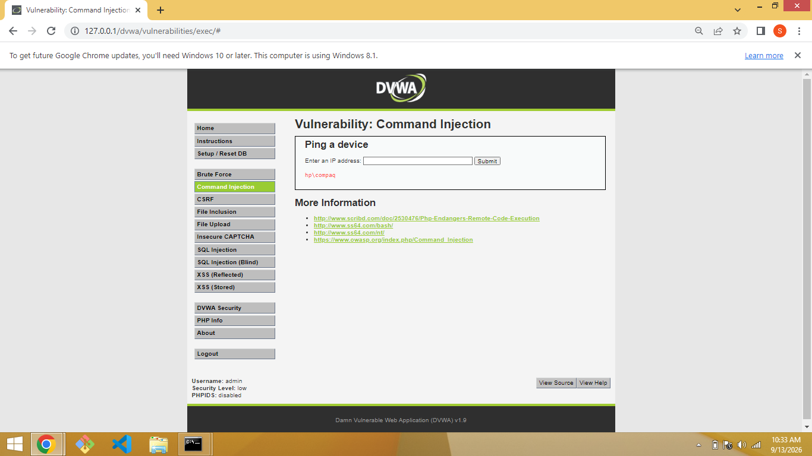
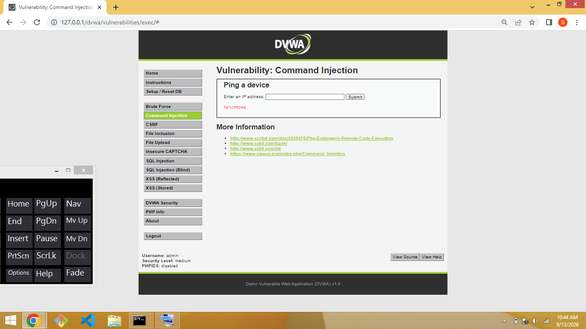
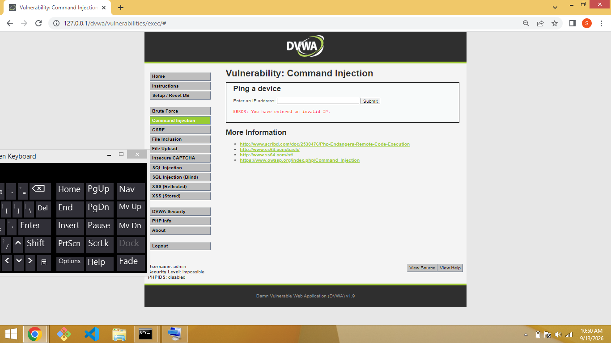

# Command Injection — DVWA (Windows Environment)

Environment note: This walkthrough was completed on Windows 8.1 (XAMPP/Apache), not the Linux/Kali environment most DVWA guides assume. Windows' cmd.exe only recognizes &, &&, |, and || as command-chaining operators — it does not treat ; as a separator the way Linux shells do. This caused some payloads from the original guide to behave differently, which is documented below.

## Low

Vulnerable code: shell_exec('ping ' . $target) — no input validation or sanitization at all.

Attempted payload (Linux-style): 127.0.0.1 ; whoami
Result: Bad parameter ;. — this is ping.exe's own error, not a DVWA block. Windows doesn't treat ; as a chain operator.

Working payload (Windows-adjusted): 127.0.0.1 | whoami
Result: hp\compaq — success

## Medium

Vulnerable code blocks && and ; using str_replace, but | is untouched.

Payload: 127.0.0.1 | whoami
Result: hp\compaq — success

## High

Vulnerable code blocks "| " (pipe followed by a space) specifically, but not a bare pipe.

Payload: 127.0.0.1|whoami (no spaces)
Result: hp\compaq — success

## Impossible

Validates that input has exactly 4 numeric octets before executing anything.

Payload: 127.0.0.1|whoami
Result: Invalid IP — rejected before reaching shell_exec()

## Key takeaway

Command injection payloads are shell-dependent. Payloads written for Linux targets don't automatically work on Windows, and vice versa — testing here required adapting Linux-style separators (;) to Windows equivalents (| and &), and distinguishing between DVWA's own filter blocking input versus the underlying OS shell (ping.exe) rejecting malformed arguments.