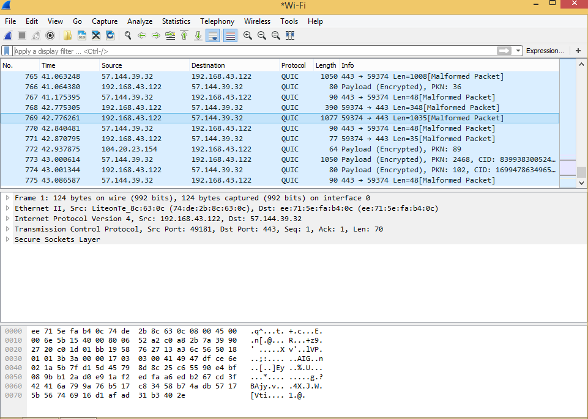
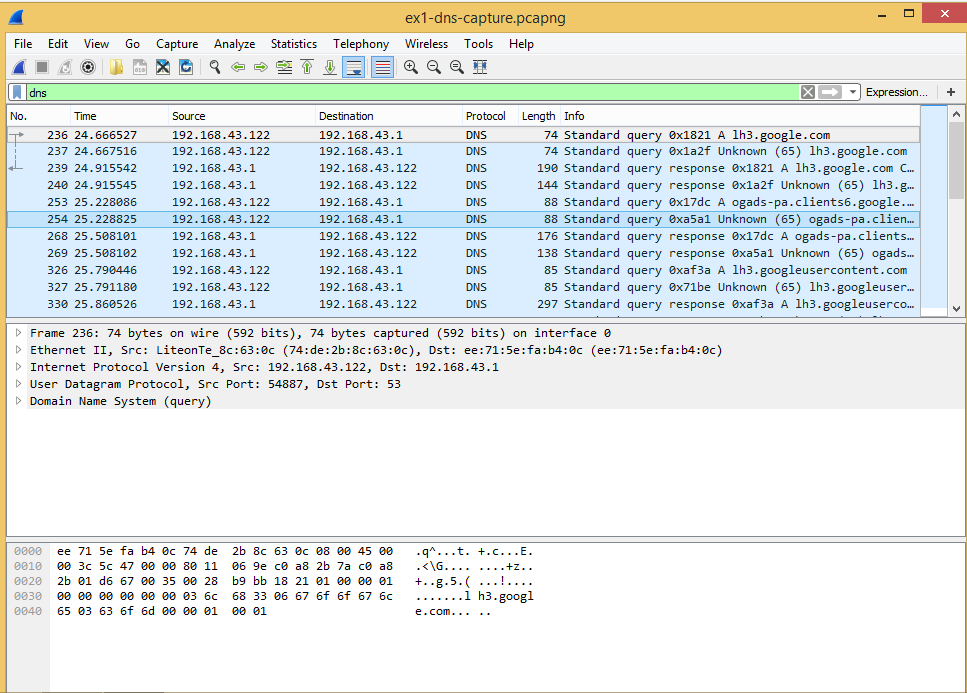
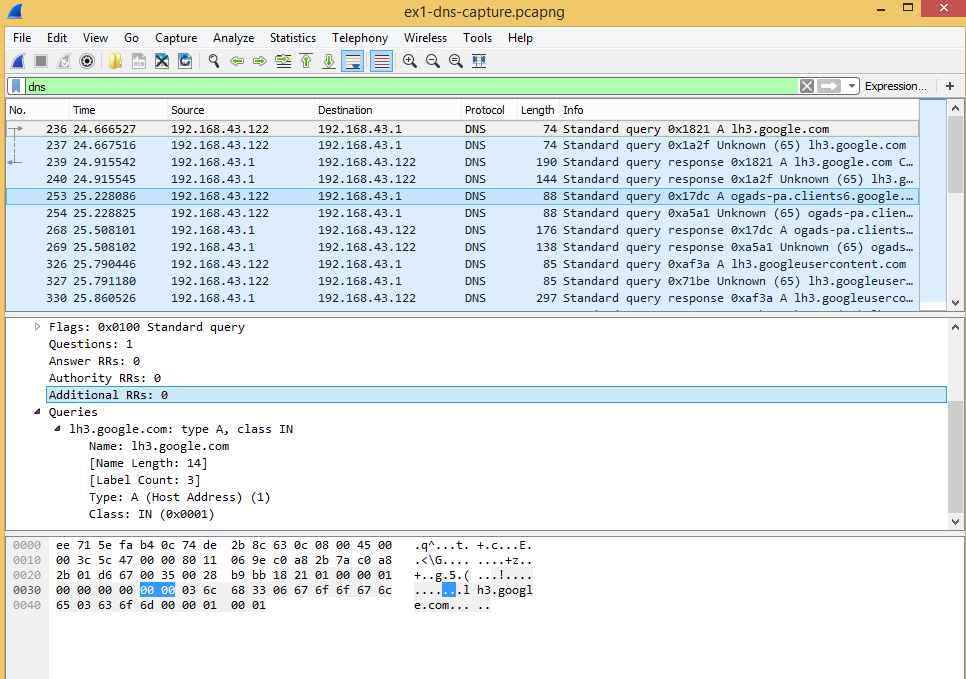
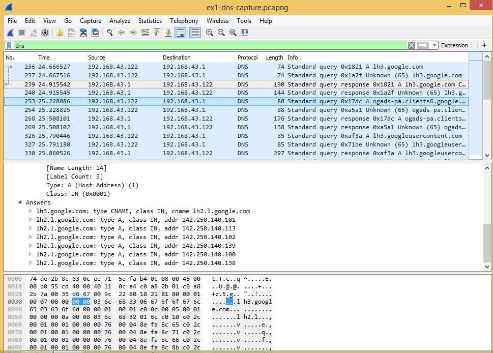
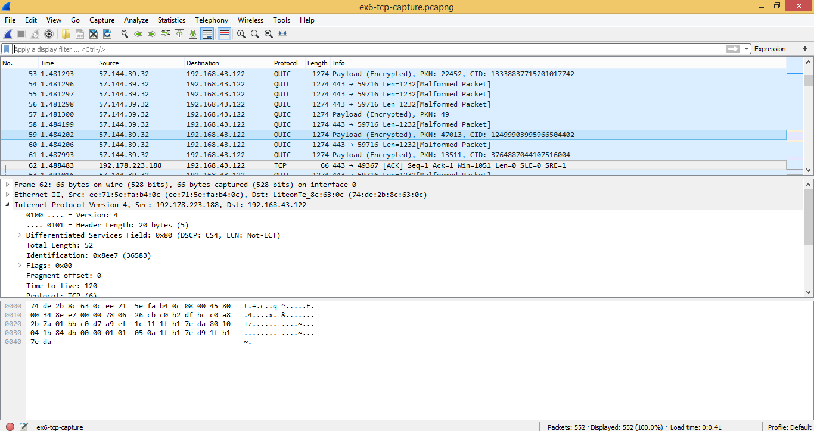
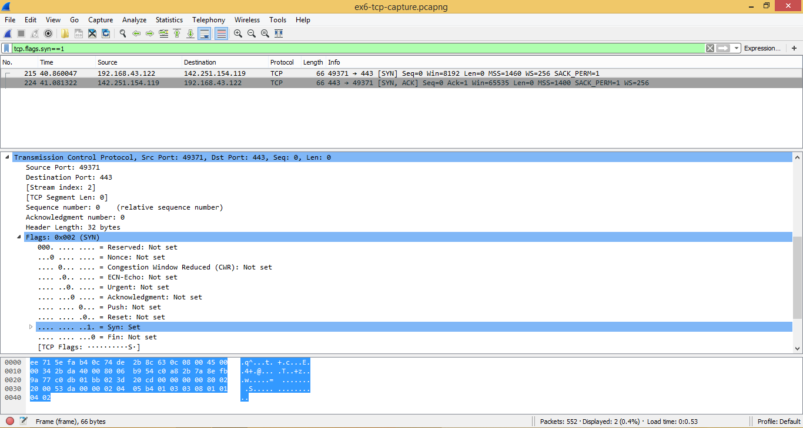
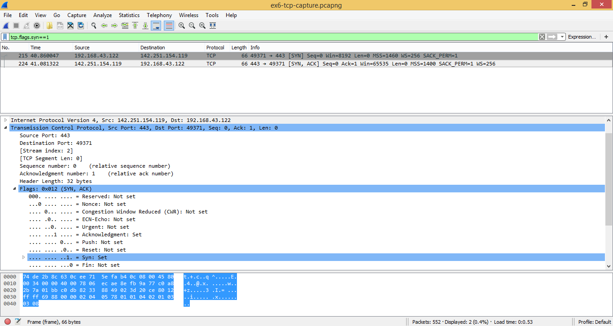
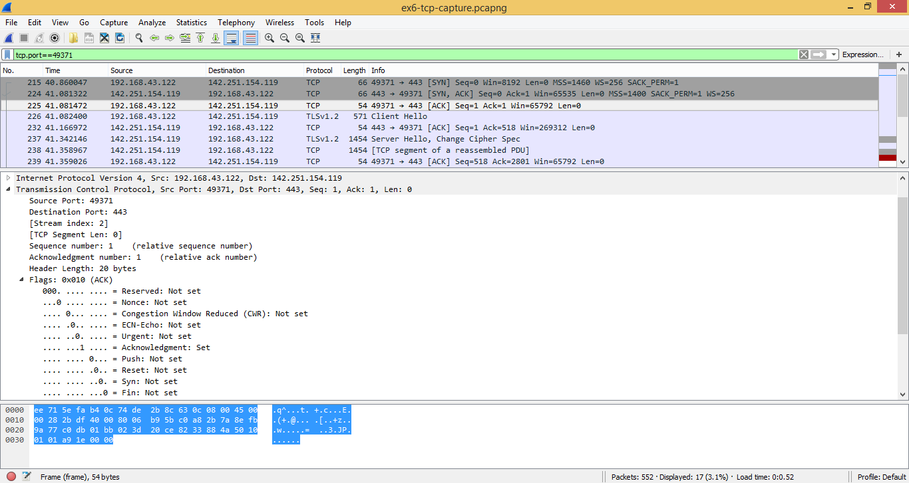
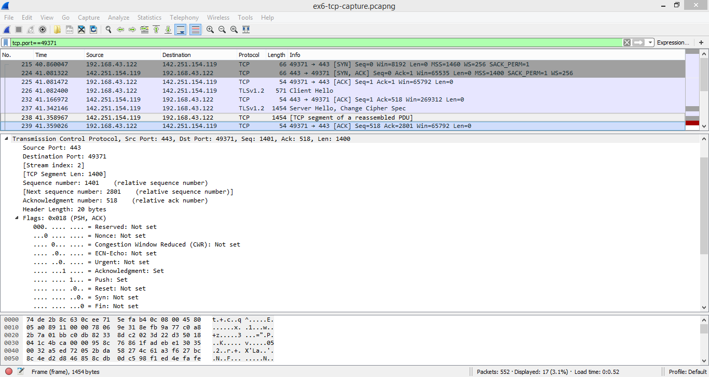
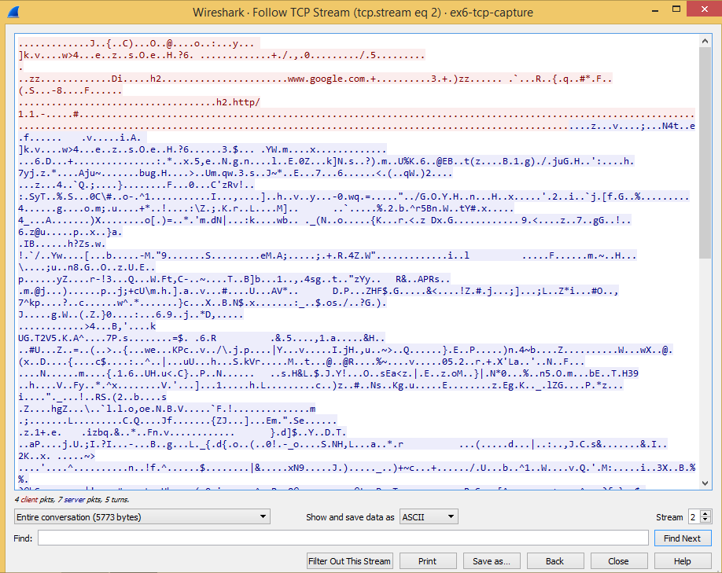

# Wireshark Project 1: Analyzing DNS, TCP, HTTP and TLS Traffic

BoyCode Africa Cybersecurity Track, Cohort 5.0: Networking Modules Assignment.
Based on: [Network-Traffic-Flow-with-WireShark-for-Beginners](https://github.com/Los-merengue/Network-Traffic-Flow-with-WireShark-for-Beginners)

*Status:* Exercises 1-10 (DNS, TCP) complete. HTTP (11-15) and TLS (16-21) in progress.

## Lab Setup

- *Machine:* HP Compaq laptop, Windows 8.1, Intel Celeron B800, 4 GB RAM
- *Tool:* Wireshark 2.2.17
- *Interface captured:* Wi-Fi

*Installation note:* the latest Wireshark (4.0.x and above) would not run on this machine because of missing Windows Update prerequisites (KB2999226 and KB2919355 both failed to install). I installed Wireshark 2.2.17 instead and added the standalone Visual C++ 2013 Redistributable (x64) to fix a missing MSVCP120.dll error.

---

## DNS

### Exercise 1: Capture DNS Traffic

#### Steps
1. Opened Wireshark and started a capture on the Wi-Fi interface.
2. Browsed to a website to generate traffic.
3. Stopped the capture and saved it.

#### Output
Capture of 775 packets, including DNS queries and responses.

### Exercise 2: Filter DNS Traffic

#### Steps
1. Entered the display filter dns and pressed Enter.

#### Output
24 of 775 packets displayed, all DNS.

### Exercise 3: Analyze DNS Requests

#### Steps
1. Selected a DNS query (packet 236).
2. Expanded *Domain Name System (query)* and *Queries* in the packet details pane.

#### Output
- Query name: lh3.google.com, Type: A (IPv4 address), Class: IN
- Sent from 192.168.43.122 (UDP port 54887) to the DNS server 192.168.43.1 (port 53)
- Transaction ID: 0x1821, Answer RRs: 0

### Exercise 4: Analyze DNS Responses

#### Steps
1. Selected the matching response (packet 239, same Transaction ID).
2. Expanded *Flags* and *Answers*.

#### Output
- Reply code: No error (0), 7 answer records
- lh3.google.com is a CNAME for lh2.l.google.com, which returned six IPv4 addresses

### Exercise 5: Examine DNS Traffic

#### Steps
1. Looked at the DNS response (packet 239) and found the returned IP addresses in the Answers section.
2. Identified the source and destination of the query and the response.
3. Compared the query and response to see how the domain name was resolved.

#### Output
- *Returned IP addresses:* 142.250.140.100, .101, .102, .113, .138 and .139.
- *Query (packet 236):* my laptop (192.168.43.122) sent an A record query for lh3.google.com to the DNS server 192.168.43.1, on port 53.
- *Response (packet 239):* the server replied with the same Transaction ID 0x1821. Flags 0x8180 (Standard query response, No error), 7 answer records.
- *How it was resolved:* the local DNS server resolved the name recursively and returned the CNAME and IPs. The lookup took about 0.25 seconds.

---

## TCP

### Exercise 6: Capture TCP Traffic

#### Steps
1. Started a new capture on the Wi-Fi interface.
2. Browsed to a website, then stopped the capture.

#### Output
Capture of 552 packets containing a mix of DNS, TCP, QUIC and other traffic.

### Exercise 7: Filter TCP Traffic

#### Steps
1. Entered the display filter tcp and pressed Enter.

#### Output
80 of 552 packets displayed (14.5%), all TCP.

### Exercise 8: Analyze the TCP Three-Way Handshake

#### Steps
1. Filtered with tcp.flags.syn==1 to find the SYN and SYN-ACK packets.
2. Filtered with tcp.port==49371 to show the whole connection and find the final ACK.
3. Expanded *Transmission Control Protocol* and *Flags* on each packet.

#### Output
| Step | Packet | Direction | Seq | Ack | Flags |
|------|--------|-----------|-----|-----|-------|
| SYN | 215 | 192.168.43.122:49371 → 142.251.154.119:443 | 0 | 0 | SYN |
| SYN-ACK | 224 | 142.251.154.119:443 → 192.168.43.122:49371 | 0 | 1 | SYN, ACK |
| ACK | 225 | 192.168.43.122:49371 → 142.251.154.119:443 | 1 | 1 | ACK |

### Exercise 9: Analyze TCP Connections

#### Steps
1. Selected a data packet from the same connection (packet 238).
2. Identified the IP addresses and ports.
3. Expanded *Transmission Control Protocol* to examine flags, sequence numbers and acknowledgment numbers.

#### Output
- Source 142.251.154.119 port 443, destination 192.168.43.122 port 49371
- Sequence number 1401, TCP segment length 1400, next sequence number 2801, acknowledgment number 518
- Flags: PSH, ACK
- Unlike the handshake packets (length 0), this packet carries data.

### Exercise 10: Follow a TCP Stream

#### Steps
1. Right-clicked a packet from the connection and chose *Follow → TCP Stream*.

#### Output
Stream 2: 4 client packets, 4 server packets, 5 turns, 5773 bytes. This is an HTTPS connection, so the content is encrypted and unreadable. Only the handshake metadata is visible in plain text, such as the server name (www.google.com) and the offered protocols (h2, http/1.1).

